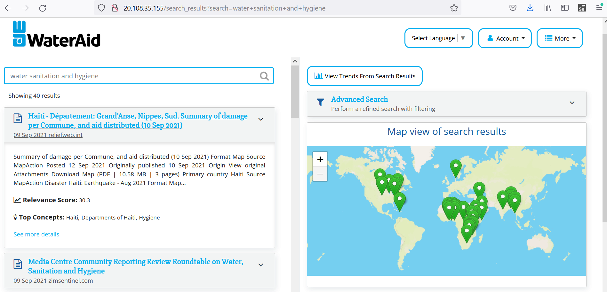
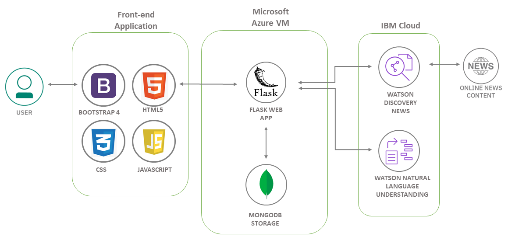

# WaterAid Search


WaterAid is an international Non-Governmental Organisation (NGO), with a long-term strategy to provide access to clean water, hygiene and sanitation to communities worldwide. To drive forward change, WaterAid continuously analyse political and social issues in order to make strategic decisions in the development of response programmes and policy changes. Currently, staff perform manual web searches and literary reviews to identify relevant documentation, a process which is time demanding and has potential to be optimised.

This project has produced the <b>WaterAid News Seach Portal</b>, a web application to speed up the process of finding and reviewing relevant news articles, with the goal to improve workflow at WaterAid. Built using Python Flask with data storage in MongoDB, the application harnesses IBM Watson Discovery and Watson Natural Language Understanding to provide cognitive search and text analytics. Functionality offered includes the ability to search through a rich source of news articles, enhanced by refined filtering capabilities to quickly identify relevant literature. Watson technologies utilise Natural Language Processing (NLP) to output document insights including sentiment, concepts, keywords and entities to provide a preview to the user and aid in speeding up literature review. The application also features data visualisations and trends analysis through location maps, graphs and word clouds, providing interest to the user.

## Contents

  - [The architecture](#the-architecture)
  - [Getting started](#getting-started)
    - [Prerequisites](#prerequisites)
    - [Installation](#installation)
  - [Live demo](#live-demo)
  - [Built with](#built-with)
  - [Authors](#authors)
  - [Acknowledgments](#acknowledgments)


## The architecture



The application has been designed to operate within a corporate environment, which provides user access and authorisation management. The site is hosted on a Microsoft Azure Virtual Machine, which is a subscription-based cloud technology. 

1. The user uses a web browser to interact with the application front-end UI.
2. User input is passed to Flask and routed to Watson APIs.
3. Watson Discovery sends input to the Watson Discovery Service hosted on IBM Cloud, which queries the Watson News Collection gathered from external news sources.
4. Watson NLU performs additional analysis on output from Watson Discovery.
5. Output from Watson APIs are stored as documents in MongoDB.
6. Flask extracts stored data, passing it to the front-end which is displayed to the user via the application UI.

## Getting started

To run the project on your local machine please use the following instructions:

### Prerequisites

* Python 3
  * [Python3](https://www.python.org/downloads/)
* pip
  * [pip](https://pip.pypa.io/en/stable/installation/)
* MongoDB - Make sure this is running!
  * [MongoDB](https://docs.mongodb.com/manual/installation/)
* IBM Cloud Account
  * [IBM Cloud](https://cloud.ibm.com/registration?cm_sp=Cloud-Home-_-LeadspaceReg-IBMCloud_CloudHome-_-LSReg)

### Installation

1. Clone the repo
   ```bash
   git clone https://github.com/AriannaBourke/WaterAidNewsSearch.git
   ```
2. Create services for [Watson Discovery](https://cloud.ibm.com/catalog/services/discovery) and [Watson Natural Language Understanding](https://cloud.ibm.com/catalog/services/natural-language-understanding)

3. In `wateraid\config.py` add your IBM Cloud credentials for Watson Discovery, Watson Natural Language Understanding and a new secret key, making sure to keep the speech marks

  ```bash
    Type: os.urandom(24) into the command line to generate a new secret key

    SECRET_KEY = '<your secret key>'
    
    AUTHENTICATOR_DISCOVERY = '<your Discovery iam api key>'
    DISCOVERY_SERVICE_URL = '<your Discovery URL>'

    AUTHENTICATOR_NLU = '<your NLU iam api key>'
    NLU_SERVICE_URL = '<your NLU URL>'
  ```
4. Open the terminal and activate the virtual environment
  ```bash
  For MacOS:
  source venv/bin/activate

  For Windows:
  venv\Scripts\activate.bat
   ```
5. Install the dependencies
   ```bash
   pip install -r requirements.txt
   ```
6. Run the app locally
   ```bash
   python run.py
   ```
  Open the app in your browser at: http://127.0.0.1:5000/

## Live demo

You can find a live demo deployed on a Microsoft Azure Virtual Machine at [http://20.108.35.155](http://20.108.35.155)

## Built with

* [Flask](https://flask.palletsprojects.com/en/2.0.x/) - The web framework used
* [MongoDB](https://www.mongodb.com/) - The NoSQL database used
* [Watson Discovery](https://www.ibm.com/uk-en/cloud/watson-discovery)
* [Watson Natural Language Understanding](https://www.ibm.com/uk-en/cloud/watson-natural-language-understanding) 


## Authors

Arianna Bourke - ariannabourke@hotmail.com


## Acknowledgments


* [Bootstrap](https://getbootstrap.com/) - UI components
* [Leaflet](https://leafletjs.com/) - Displays a world map
* [Font Awesome](https://fontawesome.com/) - Icons and fonts
* [Local-Geocode](https://github.com/mar-muel/local-geocode) - Longitude and latitude data for map markers
* [WTForms](https://wtforms.readthedocs.io/en/2.3.x/) - User input forms
* [D3.js](https://d3js.org/) - Trend visualisations
* [Plotly](https://plotly.com/) - Trend and article insight visualisations


